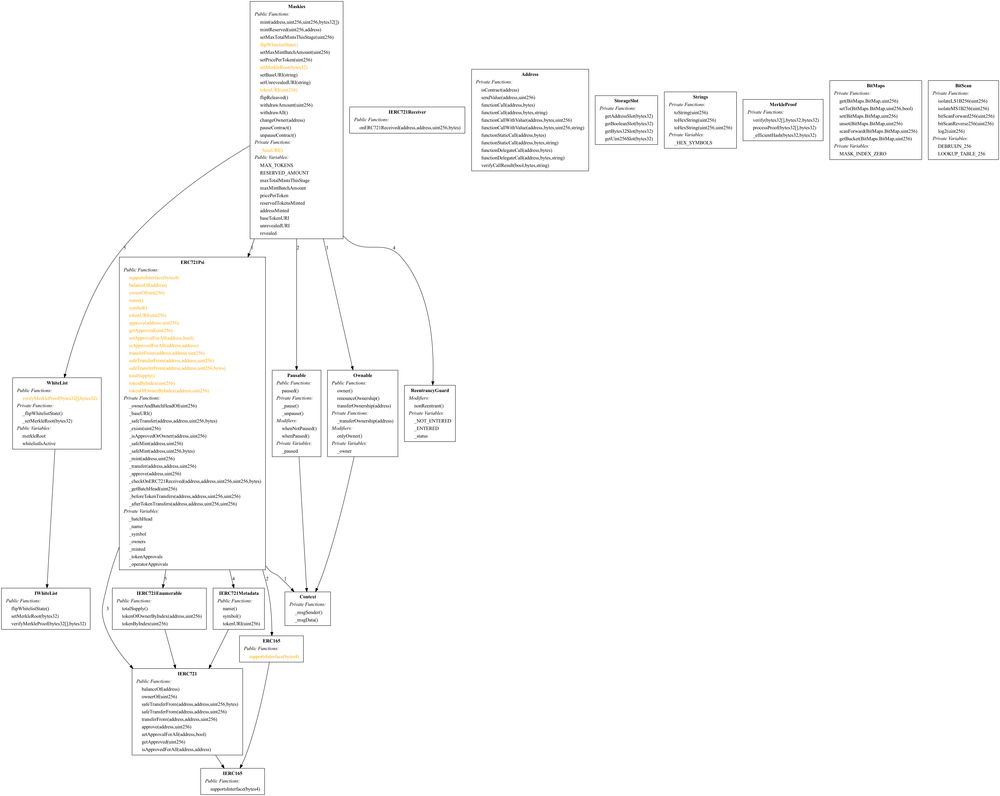

# Test report for maskies

## Introduction

Byont Labs is specialized in blockchain development with a team of dedicated Smart Contract engineers. We value reliability, security, and transparency above all else. This document is meant for everyone interested in the measures we took to enact those values and the outcomes of those measures.

## Disclaimer

This report is for informational purposes only and does not constitute investment advice of any kind. We do our very best to create safe and reliable smart contracts, but we cannot give any guarantees. 

## Copyright

All rights reserved, no part of this report may be copied or transferred.

## Summary

Byont Labs has employed various methods throughout all stages of development to improve the quality of the smart contracts:

- Specialized university grade smart contract engineers
- Requirements gathering
- Attack vector analysis
- Git version control
- Test driven development
- Fuzz testing - Automated tests that inject invalid, malformed, and unexpected inputs to test our code
- Internal code reviews for all smart contract code
- We use safe modules as much as possible, such as those provided by OpenZeppelin
- Vulnerability scans with [Slither](https://github.com/crytic/slither) - A static analysis framework for solidity

In total, 70 test scenarios were developed amounting to a total of 14605 concrete tests after adding the fuzz tests. All of these tests have passed. 

The vulnerability scans show no defects, a few false warnings are given regarding reentrancy which are in fact already solved with the implementations of OpenZeppelin’s NonReentrant module.


# Table of Contents

- [Testing approach](#testing-approach)
- [Testing](#testing)
  - [Forge fuzzing](#forge-fuzzing)
  - [Slither](#slither)
    - [slither-check-erc-terminal-output](#slither-check-erc-terminal-output)
    - [slither-function-summary-output](#slither-function-summary-output)
    - [slither-human-summary-output](#slither-human-summary-output)
    - [slither-inheritance-graph-output](#slither-inheritance-graph-output)

## Tool versions

- solc version: 0.8.13
- forge version: forge 0.2.0 (e0a5372 2022-06-02T00:13:59.438564Z)
- slither version: 0.8.3

## Testing

### Forge fuzzing

```bash
$ /Users/enzoevers/Documents/Git/byont-ventures/node_modules/.bin/nx run maskies:test --args=--solcVersion=0.8.13

> nx run maskies:test --args=--solcVersion=0.8.13

No files changed, compilation skipped

Running 70 tests for test/Maskies.t.sol:test_Maskies
[PASS] testCanChangeOwner(address,address) (runs: 256, μ: 21672, ~: 21672)
[PASS] testCanFlipReleaved() (gas: 32840)
[PASS] testCanFlipWhitelistState() (gas: 10864)
[PASS] testCanMint(address,uint256,bytes32[],uint256,uint256,uint256) (runs: 256, μ: 438388, ~: 443065)
[PASS] testCanMintReservedNft(uint256,address) (runs: 256, μ: 122827, ~: 120556)
[PASS] testCanPauzeAndUnpauseContract() (gas: 14394)
[PASS] testCanSetBaseURI(string) (runs: 256, μ: 70888, ~: 60412)
[PASS] testCanSetMaxMintBatchAmount(uint256) (runs: 256, μ: 17186, ~: 18443)
[PASS] testCanSetMaxTotalMintsThisStage(uint256) (runs: 256, μ: 17280, ~: 18518)
[PASS] testCanSetMerkleRoot(bytes32) (runs: 256, μ: 18045, ~: 18045)
[PASS] testCanSetPricePerToken(uint256) (runs: 256, μ: 14757, ~: 14889)
[PASS] testCanSetUnrevealedURI(string) (runs: 256, μ: 72614, ~: 61904)
[PASS] testCanTransferNft(address,uint256,address,uint256,uint256) (runs: 256, μ: 229649, ~: 227289)
[PASS] testCanWithdrawAllFromContract(uint256) (runs: 256, μ: 26138, ~: 26138)
[PASS] testCanWithdrawAmountFromContract(uint256,uint256) (runs: 256, μ: 26605, ~: 26605)
[PASS] testCannnotMintMoreThenMaxBatchAmount(uint256,bytes32[]) (runs: 256, μ: 55647, ~: 57538)
[PASS] testCannotChangeOwnerToCurrentOwner() (gas: 12455)
[PASS] testCannotChangeOwnerToZeroAddress() (gas: 11166)
[PASS] testCannotMintMoreThanMaxTotalMintsThisStage(address) (runs: 256, μ: 15665400, ~: 15665530)
[PASS] testCannotMintMoreThanTotalMintsMinusReservedMints(address,uint256,uint16) (runs: 256, μ: 73614527, ~: 73568584)
[PASS] testCannotMintMoreThanTotalMintsMinusTotalReservedMints(address,uint16) (runs: 256, μ: 73079048, ~: 73079397)
[PASS] testCannotMintWhenContractIsPaused(bytes32[]) (runs: 256, μ: 46710, ~: 55197)
[PASS] testCannotMintWithInsufficientEth(uint256,uint256,uint256,bytes32[]) (runs: 256, μ: 71353, ~: 71447)
[PASS] testCannotMintWithInvalidProof(address,uint256,bytes32[],uint256,uint256,uint256) (runs: 256, μ: 339558, ~: 345885)
[PASS] testCannotMintZeroAmount(address,uint256,bytes32[],uint256,uint256) (runs: 256, μ: 341574, ~: 352635)
[PASS] testCannotSetEmptyBaseURI() (gas: 11619)
[PASS] testCannotSetEmptyUnrevealedURI() (gas: 11618)
[PASS] testCannotSetMaxTotalMintsThisStageHigherThanTotalMax(uint256) (runs: 256, μ: 12481, ~: 12481)
[PASS] testCannotSetMintBatchAmountHigherThanTotalMax(uint256) (runs: 256, μ: 12415, ~: 12415)
[PASS] testCannotTransferNonOwnedNft(address,uint256,address,uint256,uint256) (runs: 256, μ: 183246, ~: 182445)
[PASS] testCannotWithWhenContractBalanceIsZero() (gas: 14161)
[PASS] testCannotWithZeroAmount() (gas: 16097)
[PASS] testCannotWithdrawMoreThanContractBalance(uint256,uint256) (runs: 256, μ: 14642, ~: 14642)
[PASS] testEmitChangeOwner(address) (runs: 256, μ: 20101, ~: 20101)
[PASS] testEmitFlipReleaved() (gas: 35835)
[PASS] testEmitFlipWhitelistState() (gas: 13903)
[PASS] testEmitMint(address,uint256,bytes32[],uint256,uint256,uint256) (runs: 256, μ: 437386, ~: 442454)
[PASS] testEmitMintReserved(uint256,address) (runs: 256, μ: 116710, ~: 114966)
[PASS] testEmitSetBaseURI(string) (runs: 256, μ: 68098, ~: 57969)
[PASS] testEmitSetMaxMintBatchAmount(uint256) (runs: 256, μ: 17756, ~: 19013)
[PASS] testEmitSetMaxTotalMintsThisStage(uint256) (runs: 256, μ: 17853, ~: 19110)
[PASS] testEmitSetMerkleRoot(bytes32) (runs: 256, μ: 18463, ~: 18463)
[PASS] testEmitSetPricePerToken(uint256) (runs: 256, μ: 17761, ~: 17893)
[PASS] testEmitSetUnrevealedURI(string) (runs: 256, μ: 70878, ~: 60348)
[PASS] testEmitWithdrawAll(uint256) (runs: 256, μ: 24945, ~: 24945)
[PASS] testEmitWithdrawAmount(uint256,uint256) (runs: 256, μ: 25392, ~: 25392)
[PASS] testGivingOtherMaxMintsDoesNotFoolMerkleProof(address,uint256,bytes32[],uint256,uint256,uint256) (runs: 256, μ: 340177, ~: 335269)
[PASS] testMintReservedCanNotMintMoreThenReservedAmount(uint256,address) (runs: 256, μ: 20364, ~: 20364)
[PASS] testMintReservedRevertsOnZeroAddress(uint256) (runs: 256, μ: 42741, ~: 42741)
[PASS] testMintReservedRevertsOnZeroAmount(address) (runs: 256, μ: 21738, ~: 21738)
[PASS] testNameAndSymbolAreCorrect() (gas: 15146)
[PASS] testOnlyOwnerChangeOwner(address,address) (runs: 256, μ: 13742, ~: 13742)
[PASS] testOnlyOwnerFlipReleaved(address) (runs: 256, μ: 13520, ~: 13520)
[PASS] testOnlyOwnerFlipWhitelistState(address) (runs: 256, μ: 13476, ~: 13476)
[PASS] testOnlyOwnerMintReserved(address,uint256,address) (runs: 256, μ: 13786, ~: 13786)
[PASS] testOnlyOwnerPauseContract(address) (runs: 256, μ: 13435, ~: 13435)
[PASS] testOnlyOwnerSetBaseURI(address,string) (runs: 256, μ: 14204, ~: 14204)
[PASS] testOnlyOwnerSetMaxTotalMintsThisStage(address,uint256) (runs: 256, μ: 14709, ~: 14709)
[PASS] testOnlyOwnerSetMerkleRoot(address,bytes32) (runs: 256, μ: 13609, ~: 13609)
[PASS] testOnlyOwnerSetPricePerToken(address,uint256) (runs: 256, μ: 13632, ~: 13632)
[PASS] testOnlyOwnerSetUnrevealedURI(address,string) (runs: 256, μ: 14157, ~: 14157)
[PASS] testOnlyOwnerUnpauseContract(address) (runs: 256, μ: 13498, ~: 13498)
[PASS] testOnlyOwnerWithDrawAll(address) (runs: 256, μ: 13545, ~: 13545)
[PASS] testOnlyOwnerWithDrawAmount(address,uint256) (runs: 256, μ: 13634, ~: 13634)
[PASS] testReturnRevealedUriWhenRevealed(string,uint256,address,uint256,uint256) (runs: 256, μ: 271651, ~: 278443)
[PASS] testReturnUnrevealedUriWhenNotRevealed(string,uint256,address,uint256,uint256) (runs: 256, μ: 248554, ~: 254705)
[PASS] testRevertsOnNonExistingTokenId(uint256) (runs: 256, μ: 11662, ~: 11662)
[PASS] testRevertsOnZeroRoot() (gas: 11438)
[PASS] testRevertsWhenNoMerkleRootIsSet(address,uint256,bytes32[],uint256,uint256,uint256) (runs: 256, μ: 255787, ~: 258550)
[PASS] testUserCannotMintMoreThenPerUserLimit(address,uint256,bytes32[],uint256,uint256) (runs: 256, μ: 1148186, ~: 470198)
Test result: ok. 70 passed; 0 failed; finished in 68.23s
╭────────────────────┬─────────────────┬───────┬────────┬───────┬─────────╮
│ Maskies contract   ┆                 ┆       ┆        ┆       ┆         │
╞════════════════════╪═════════════════╪═══════╪════════╪═══════╪═════════╡
│ Deployment Cost    ┆ Deployment Size ┆       ┆        ┆       ┆         │
├╌╌╌╌╌╌╌╌╌╌╌╌╌╌╌╌╌╌╌╌┼╌╌╌╌╌╌╌╌╌╌╌╌╌╌╌╌╌┼╌╌╌╌╌╌╌┼╌╌╌╌╌╌╌╌┼╌╌╌╌╌╌╌┼╌╌╌╌╌╌╌╌╌┤
│ 3042257            ┆ 14772           ┆       ┆        ┆       ┆         │
├╌╌╌╌╌╌╌╌╌╌╌╌╌╌╌╌╌╌╌╌┼╌╌╌╌╌╌╌╌╌╌╌╌╌╌╌╌╌┼╌╌╌╌╌╌╌┼╌╌╌╌╌╌╌╌┼╌╌╌╌╌╌╌┼╌╌╌╌╌╌╌╌╌┤
│ Function Name      ┆ min             ┆ avg   ┆ median ┆ max   ┆ # calls │
├╌╌╌╌╌╌╌╌╌╌╌╌╌╌╌╌╌╌╌╌┼╌╌╌╌╌╌╌╌╌╌╌╌╌╌╌╌╌┼╌╌╌╌╌╌╌┼╌╌╌╌╌╌╌╌┼╌╌╌╌╌╌╌┼╌╌╌╌╌╌╌╌╌┤
│ changeOwner        ┆ 878             ┆ 1782  ┆ 1782   ┆ 2687  ┆ 2       │
├╌╌╌╌╌╌╌╌╌╌╌╌╌╌╌╌╌╌╌╌┼╌╌╌╌╌╌╌╌╌╌╌╌╌╌╌╌╌┼╌╌╌╌╌╌╌┼╌╌╌╌╌╌╌╌┼╌╌╌╌╌╌╌┼╌╌╌╌╌╌╌╌╌┤
│ flipReleaved       ┆ 23601           ┆ 23601 ┆ 23601  ┆ 23601 ┆ 2       │
├╌╌╌╌╌╌╌╌╌╌╌╌╌╌╌╌╌╌╌╌┼╌╌╌╌╌╌╌╌╌╌╌╌╌╌╌╌╌┼╌╌╌╌╌╌╌┼╌╌╌╌╌╌╌╌┼╌╌╌╌╌╌╌┼╌╌╌╌╌╌╌╌╌┤
│ flipWhitelistState ┆ 5212            ┆ 5212  ┆ 5212   ┆ 5212  ┆ 2       │
├╌╌╌╌╌╌╌╌╌╌╌╌╌╌╌╌╌╌╌╌┼╌╌╌╌╌╌╌╌╌╌╌╌╌╌╌╌╌┼╌╌╌╌╌╌╌┼╌╌╌╌╌╌╌╌┼╌╌╌╌╌╌╌┼╌╌╌╌╌╌╌╌╌┤
│ name               ┆ 3355            ┆ 3355  ┆ 3355   ┆ 3355  ┆ 1       │
├╌╌╌╌╌╌╌╌╌╌╌╌╌╌╌╌╌╌╌╌┼╌╌╌╌╌╌╌╌╌╌╌╌╌╌╌╌╌┼╌╌╌╌╌╌╌┼╌╌╌╌╌╌╌╌┼╌╌╌╌╌╌╌┼╌╌╌╌╌╌╌╌╌┤
│ owner              ┆ 2498            ┆ 2498  ┆ 2498   ┆ 2498  ┆ 1       │
├╌╌╌╌╌╌╌╌╌╌╌╌╌╌╌╌╌╌╌╌┼╌╌╌╌╌╌╌╌╌╌╌╌╌╌╌╌╌┼╌╌╌╌╌╌╌┼╌╌╌╌╌╌╌╌┼╌╌╌╌╌╌╌┼╌╌╌╌╌╌╌╌╌┤
│ pauseContract      ┆ 4644            ┆ 4644  ┆ 4644   ┆ 4644  ┆ 1       │
├╌╌╌╌╌╌╌╌╌╌╌╌╌╌╌╌╌╌╌╌┼╌╌╌╌╌╌╌╌╌╌╌╌╌╌╌╌╌┼╌╌╌╌╌╌╌┼╌╌╌╌╌╌╌╌┼╌╌╌╌╌╌╌┼╌╌╌╌╌╌╌╌╌┤
│ paused             ┆ 338             ┆ 1004  ┆ 338    ┆ 2338  ┆ 3       │
├╌╌╌╌╌╌╌╌╌╌╌╌╌╌╌╌╌╌╌╌┼╌╌╌╌╌╌╌╌╌╌╌╌╌╌╌╌╌┼╌╌╌╌╌╌╌┼╌╌╌╌╌╌╌╌┼╌╌╌╌╌╌╌┼╌╌╌╌╌╌╌╌╌┤
│ revealed           ┆ 411             ┆ 1744  ┆ 2411   ┆ 2411  ┆ 3       │
├╌╌╌╌╌╌╌╌╌╌╌╌╌╌╌╌╌╌╌╌┼╌╌╌╌╌╌╌╌╌╌╌╌╌╌╌╌╌┼╌╌╌╌╌╌╌┼╌╌╌╌╌╌╌╌┼╌╌╌╌╌╌╌┼╌╌╌╌╌╌╌╌╌┤
│ setBaseURI         ┆ 2817            ┆ 2817  ┆ 2817   ┆ 2817  ┆ 1       │
├╌╌╌╌╌╌╌╌╌╌╌╌╌╌╌╌╌╌╌╌┼╌╌╌╌╌╌╌╌╌╌╌╌╌╌╌╌╌┼╌╌╌╌╌╌╌┼╌╌╌╌╌╌╌╌┼╌╌╌╌╌╌╌┼╌╌╌╌╌╌╌╌╌┤
│ setMerkleRoot      ┆ 2752            ┆ 2752  ┆ 2752   ┆ 2752  ┆ 1       │
├╌╌╌╌╌╌╌╌╌╌╌╌╌╌╌╌╌╌╌╌┼╌╌╌╌╌╌╌╌╌╌╌╌╌╌╌╌╌┼╌╌╌╌╌╌╌┼╌╌╌╌╌╌╌╌┼╌╌╌╌╌╌╌┼╌╌╌╌╌╌╌╌╌┤
│ setUnrevealedURI   ┆ 2837            ┆ 2837  ┆ 2837   ┆ 2837  ┆ 1       │
├╌╌╌╌╌╌╌╌╌╌╌╌╌╌╌╌╌╌╌╌┼╌╌╌╌╌╌╌╌╌╌╌╌╌╌╌╌╌┼╌╌╌╌╌╌╌┼╌╌╌╌╌╌╌╌┼╌╌╌╌╌╌╌┼╌╌╌╌╌╌╌╌╌┤
│ symbol             ┆ 3309            ┆ 3309  ┆ 3309   ┆ 3309  ┆ 1       │
├╌╌╌╌╌╌╌╌╌╌╌╌╌╌╌╌╌╌╌╌┼╌╌╌╌╌╌╌╌╌╌╌╌╌╌╌╌╌┼╌╌╌╌╌╌╌┼╌╌╌╌╌╌╌╌┼╌╌╌╌╌╌╌┼╌╌╌╌╌╌╌╌╌┤
│ unpauseContract    ┆ 1500            ┆ 1500  ┆ 1500   ┆ 1500  ┆ 1       │
├╌╌╌╌╌╌╌╌╌╌╌╌╌╌╌╌╌╌╌╌┼╌╌╌╌╌╌╌╌╌╌╌╌╌╌╌╌╌┼╌╌╌╌╌╌╌┼╌╌╌╌╌╌╌╌┼╌╌╌╌╌╌╌┼╌╌╌╌╌╌╌╌╌┤
│ whitelistIsActive  ┆ 345             ┆ 1678  ┆ 2345   ┆ 2345  ┆ 3       │
├╌╌╌╌╌╌╌╌╌╌╌╌╌╌╌╌╌╌╌╌┼╌╌╌╌╌╌╌╌╌╌╌╌╌╌╌╌╌┼╌╌╌╌╌╌╌┼╌╌╌╌╌╌╌╌┼╌╌╌╌╌╌╌┼╌╌╌╌╌╌╌╌╌┤
│ withdrawAll        ┆ 7596            ┆ 7596  ┆ 7596   ┆ 7596  ┆ 1       │
├╌╌╌╌╌╌╌╌╌╌╌╌╌╌╌╌╌╌╌╌┼╌╌╌╌╌╌╌╌╌╌╌╌╌╌╌╌╌┼╌╌╌╌╌╌╌┼╌╌╌╌╌╌╌╌┼╌╌╌╌╌╌╌┼╌╌╌╌╌╌╌╌╌┤
│ withdrawAmount     ┆ 7597            ┆ 7597  ┆ 7597   ┆ 7597  ┆ 1       │
╰────────────────────┴─────────────────┴───────┴────────┴───────┴─────────╯
╭────────────────────┬─────────────────┬───────┬────────┬───────┬─────────╮
│ Utils contract     ┆                 ┆       ┆        ┆       ┆         │
╞════════════════════╪═════════════════╪═══════╪════════╪═══════╪═════════╡
│ Deployment Cost    ┆ Deployment Size ┆       ┆        ┆       ┆         │
├╌╌╌╌╌╌╌╌╌╌╌╌╌╌╌╌╌╌╌╌┼╌╌╌╌╌╌╌╌╌╌╌╌╌╌╌╌╌┼╌╌╌╌╌╌╌┼╌╌╌╌╌╌╌╌┼╌╌╌╌╌╌╌┼╌╌╌╌╌╌╌╌╌┤
│ 242717             ┆ 1229            ┆       ┆        ┆       ┆         │
├╌╌╌╌╌╌╌╌╌╌╌╌╌╌╌╌╌╌╌╌┼╌╌╌╌╌╌╌╌╌╌╌╌╌╌╌╌╌┼╌╌╌╌╌╌╌┼╌╌╌╌╌╌╌╌┼╌╌╌╌╌╌╌┼╌╌╌╌╌╌╌╌╌┤
│ Function Name      ┆ min             ┆ avg   ┆ median ┆ max   ┆ # calls │
├╌╌╌╌╌╌╌╌╌╌╌╌╌╌╌╌╌╌╌╌┼╌╌╌╌╌╌╌╌╌╌╌╌╌╌╌╌╌┼╌╌╌╌╌╌╌┼╌╌╌╌╌╌╌╌┼╌╌╌╌╌╌╌┼╌╌╌╌╌╌╌╌╌┤
│ createUsers        ┆ 11787           ┆ 11787 ┆ 11787  ┆ 11787 ┆ 70      │
├╌╌╌╌╌╌╌╌╌╌╌╌╌╌╌╌╌╌╌╌┼╌╌╌╌╌╌╌╌╌╌╌╌╌╌╌╌╌┼╌╌╌╌╌╌╌┼╌╌╌╌╌╌╌╌┼╌╌╌╌╌╌╌┼╌╌╌╌╌╌╌╌╌┤
│ getNextUserAddress ┆ 536             ┆ 536   ┆ 536    ┆ 536   ┆ 350     │
╰────────────────────┴─────────────────┴───────┴────────┴───────┴─────────╯


 >  NX   Successfully ran target test for project maskies


```

### Slither

#### slither-check-erc-terminal-output

```bash
# Check Maskies

## Check functions
[✓] balanceOf(address) is present
	[✓] balanceOf(address) -> (uint256) (correct return type)
	[✓] balanceOf(address) is view
[✓] ownerOf(uint256) is present
	[✓] ownerOf(uint256) -> (address) (correct return type)
	[✓] ownerOf(uint256) is view
[✓] safeTransferFrom(address,address,uint256,bytes) is present
	[✓] safeTransferFrom(address,address,uint256,bytes) -> () (correct return type)
	[✓] Transfer(address,address,uint256) is emitted
[✓] safeTransferFrom(address,address,uint256) is present
	[✓] safeTransferFrom(address,address,uint256) -> () (correct return type)
	[✓] Transfer(address,address,uint256) is emitted
[✓] transferFrom(address,address,uint256) is present
	[✓] transferFrom(address,address,uint256) -> () (correct return type)
	[✓] Transfer(address,address,uint256) is emitted
[✓] approve(address,uint256) is present
	[✓] approve(address,uint256) -> () (correct return type)
	[✓] Approval(address,address,uint256) is emitted
[✓] setApprovalForAll(address,bool) is present
	[✓] setApprovalForAll(address,bool) -> () (correct return type)
	[✓] ApprovalForAll(address,address,bool) is emitted
[✓] getApproved(uint256) is present
	[✓] getApproved(uint256) -> (address) (correct return type)
	[✓] getApproved(uint256) is view
[✓] isApprovedForAll(address,address) is present
	[✓] isApprovedForAll(address,address) -> (bool) (correct return type)
	[✓] isApprovedForAll(address,address) is view
[✓] supportsInterface(bytes4) is present
	[✓] supportsInterface(bytes4) -> (bool) (correct return type)
	[✓] supportsInterface(bytes4) is view
[✓] name() is present
	[✓] name() -> (string) (correct return type)
	[✓] name() is view
[✓] symbol() is present
	[✓] symbol() -> (string) (correct return type)
[✓] tokenURI(uint256) is present
	[✓] tokenURI(uint256) -> (string) (correct return type)

## Check events
[✓] Transfer(address,address,uint256) is present
	[✓] parameter 0 is indexed
	[✓] parameter 1 is indexed
	[✓] parameter 2 is indexed
[✓] Approval(address,address,uint256) is present
	[✓] parameter 0 is indexed
	[✓] parameter 1 is indexed
	[✓] parameter 2 is indexed
[✓] ApprovalForAll(address,address,bool) is present
	[✓] parameter 0 is indexed
	[✓] parameter 1 is indexed


```

#### slither-function-summary-output

```bash
Compilation warnings/errors on apps/maskies/src/Maskies.sol:
Warning: Unnamed return variable can remain unassigned when the function is called when "Maskies" is the most derived contract. Add an explicit return with value to all non-reverting code paths or name the variable.
   --> node_modules/erc721psi/contracts/ERC721Psi.sol:477:80:
    |
477 |     function tokenByIndex(uint256 index) public view virtual override returns (uint256) {
    |                                                                                ^^^^^^^

Warning: Unnamed return variable can remain unassigned. Add an explicit return with value to all non-reverting code paths or name the variable.
  --> node_modules/solidity-bits/contracts/BitMaps.sol:82:87:
   |
82 |     function scanForward(BitMap storage bitmap, uint256 index) internal view returns (uint256) {
   |                                                                                       ^^^^^^^

Warning: Unused local variable.
   --> node_modules/erc721psi/contracts/ERC721Psi.sol:102:25:
    |
102 |         (address owner, uint256 tokenIdBatchHead) = _ownerAndBatchHeadOf(tokenId);
    |                         ^^^^^^^^^^^^^^^^^^^^^^^^

Warning: Contract code size is 25784 bytes and exceeds 24576 bytes (a limit introduced in Spurious Dragon). This contract may not be deployable on mainnet. Consider enabling the optimizer (with a low "runs" value!), turning off revert strings, or using libraries.
  --> apps/maskies/src/Maskies.sol:18:1:
   |
18 | contract Maskies is ERC721Psi, Pausable, Ownable, ReentrancyGuard, WhiteList {
   | ^ (Relevant source part starts here and spans across multiple lines).


Contract IWhiteList
Contract vars: []
Inheritance:: []

+--------------------------------------+------------+-----------+------+-------+----------------+----------------+
|               Function               | Visibility | Modifiers | Read | Write | Internal Calls | External Calls |
+--------------------------------------+------------+-----------+------+-------+----------------+----------------+
|         flipWhitelistState()         |  external  |     []    |  []  |   []  |       []       |       []       |
|        setMerkleRoot(bytes32)        |  external  |     []    |  []  |   []  |       []       |       []       |
| verifyMerkleProof(bytes32[],bytes32) |  external  |     []    |  []  |   []  |       []       |       []       |
+--------------------------------------+------------+-----------+------+-------+----------------+----------------+

+-----------+------------+------+-------+----------------+----------------+
| Modifiers | Visibility | Read | Write | Internal Calls | External Calls |
+-----------+------------+------+-------+----------------+----------------+
+-----------+------------+------+-------+----------------+----------------+


Contract WhiteList
Contract vars: ['merkleRoot', 'whitelistIsActive']
Inheritance:: ['IWhiteList']

+--------------------------------------+------------+-----------+-----------------------+-------------------------------------+----------------------------------------------+-------------------------------------------------------------------------+
|               Function               | Visibility | Modifiers |          Read         |                Write                |                Internal Calls                |                              External Calls                             |
+--------------------------------------+------------+-----------+-----------------------+-------------------------------------+----------------------------------------------+-------------------------------------------------------------------------+
|         flipWhitelistState()         |  external  |     []    |           []          |                  []                 |                      []                      |                                    []                                   |
|        setMerkleRoot(bytes32)        |  external  |     []    |           []          |                  []                 |                      []                      |                                    []                                   |
| verifyMerkleProof(bytes32[],bytes32) |  external  |     []    |           []          |                  []                 |                      []                      |                                    []                                   |
|        _flipWhitelistState()         |  internal  |     []    | ['whitelistIsActive'] |        ['whitelistIsActive']        |                      []                      |                                    []                                   |
|       _setMerkleRoot(bytes32)        |  internal  |     []    |           []          |            ['merkleRoot']           | ['keccak256(bytes)', 'require(bool,string)'] |                        ['abi.encode(uint256(0))']                       |
|                                      |            |           |                       |                                     |               ['abi.encode()']               |                                                                         |
| verifyMerkleProof(bytes32[],bytes32) |   public   |     []    |     ['merkleRoot']    |                  []                 | ['keccak256(bytes)', 'require(bool,string)'] | ['MerkleProof.verify(proof,merkleRoot,leaf)', 'abi.encode(uint256(0))'] |
|                                      |            |           |                       |                                     |               ['abi.encode()']               |                                                                         |
|    slitherConstructorVariables()     |  internal  |     []    |           []          | ['merkleRoot', 'whitelistIsActive'] |     ['keccak256(bytes)', 'abi.encode()']     |                                    []                                   |
+--------------------------------------+------------+-----------+-----------------------+-------------------------------------+----------------------------------------------+-------------------------------------------------------------------------+

+-----------+------------+------+-------+----------------+----------------+
| Modifiers | Visibility | Read | Write | Internal Calls | External Calls |
+-----------+------------+------+-------+----------------+----------------+
+-----------+------------+------+-------+----------------+----------------+


Contract Maskies
Contract vars: ['_batchHead', '_name', '_symbol', '_owners', '_minted', '_tokenApprovals', '_operatorApprovals', '_paused', '_owner', '_NOT_ENTERED', '_ENTERED', '_status', 'merkleRoot', 'whitelistIsActive', 'MAX_TOKENS', 'RESERVED_AMOUNT', 'maxTotalMintsThisStage', 'maxMintBatchAmount', 'pricePerToken', 'reservedTokensMinted', 'addressMinted', 'baseTokenURI', 'unrevealedURI', 'revealed']
Inheritance:: ['WhiteList', 'IWhiteList', 'ReentrancyGuard', 'Ownable', 'Pausable', 'ERC721Psi', 'IERC721Enumerable', 'IERC721Metadata', 'IERC721', 'ERC165', 'IERC165', 'Context']

+---------------------------------------------------------------+------------+-----------------------------------+-----------------------------------------------+-------------------------------------------+----------------------------------------------------+----------------------------------------------------------------------------------------------+
|                            Function                           | Visibility |             Modifiers             |                      Read                     |                   Write                   |                   Internal Calls                   |                                        External Calls                                        |
+---------------------------------------------------------------+------------+-----------------------------------+-----------------------------------------------+-------------------------------------------+----------------------------------------------------+----------------------------------------------------------------------------------------------+
|                     _flipWhitelistState()                     |  internal  |                 []                |             ['whitelistIsActive']             |           ['whitelistIsActive']           |                         []                         |                                              []                                              |
|                    _setMerkleRoot(bytes32)                    |  internal  |                 []                |                       []                      |               ['merkleRoot']              |    ['keccak256(bytes)', 'require(bool,string)']    |                                  ['abi.encode(uint256(0))']                                  |
|                                                               |            |                                   |                                               |                                           |                  ['abi.encode()']                  |                                                                                              |
|              verifyMerkleProof(bytes32[],bytes32)             |   public   |                 []                |                 ['merkleRoot']                |                     []                    |    ['keccak256(bytes)', 'require(bool,string)']    |           ['MerkleProof.verify(proof,merkleRoot,leaf)', 'abi.encode(uint256(0))']            |
|                                                               |            |                                   |                                               |                                           |                  ['abi.encode()']                  |                                                                                              |
|                      flipWhitelistState()                     |  external  |                 []                |                       []                      |                     []                    |                         []                         |                                              []                                              |
|                     setMerkleRoot(bytes32)                    |  external  |                 []                |                       []                      |                     []                    |                         []                         |                                              []                                              |
|              verifyMerkleProof(bytes32[],bytes32)             |  external  |                 []                |                       []                      |                     []                    |                         []                         |                                              []                                              |
|                         constructor()                         |  internal  |                 []                |                ['_NOT_ENTERED']               |                ['_status']                |                         []                         |                                              []                                              |
|                         constructor()                         |  internal  |                 []                |                       []                      |                     []                    |        ['_transferOwnership', '_msgSender']        |                                              []                                              |
|                            owner()                            |   public   |                 []                |                   ['_owner']                  |                     []                    |                         []                         |                                              []                                              |
|                      renounceOwnership()                      |   public   |           ['onlyOwner']           |                       []                      |                     []                    |        ['onlyOwner', '_transferOwnership']         |                                              []                                              |
|                   transferOwnership(address)                  |   public   |           ['onlyOwner']           |                       []                      |                     []                    |       ['require(bool,string)', 'onlyOwner']        |                                              []                                              |
|                                                               |            |                                   |                                               |                                           |               ['_transferOwnership']               |                                                                                              |
|                  _transferOwnership(address)                  |  internal  |                 []                |                   ['_owner']                  |                 ['_owner']                |                         []                         |                                              []                                              |
|                          _msgSender()                         |  internal  |                 []                |                 ['msg.sender']                |                     []                    |                         []                         |                                              []                                              |
|                           _msgData()                          |  internal  |                 []                |                  ['msg.data']                 |                     []                    |                         []                         |                                              []                                              |
|                         constructor()                         |  internal  |                 []                |                       []                      |                ['_paused']                |                         []                         |                                              []                                              |
|                            paused()                           |   public   |                 []                |                  ['_paused']                  |                     []                    |                         []                         |                                              []                                              |
|                            _pause()                           |  internal  |         ['whenNotPaused']         |                       []                      |                ['_paused']                |          ['whenNotPaused', '_msgSender']           |                                              []                                              |
|                           _unpause()                          |  internal  |           ['whenPaused']          |                       []                      |                ['_paused']                |            ['whenPaused', '_msgSender']            |                                              []                                              |
|                   constructor(string,string)                  |   public   |                 []                |                       []                      |            ['_name', '_symbol']           |                         []                         |                                              []                                              |
|                   supportsInterface(bytes4)                   |   public   |                 []                |                       []                      |                     []                    |          ['supportsInterface', 'type()']           |                                              []                                              |
|                       balanceOf(address)                      |   public   |                 []                |                  ['_minted']                  |                     []                    |        ['_exists', 'require(bool,string)']         |                                              []                                              |
|                                                               |            |                                   |                                               |                                           |                    ['ownerOf']                     |                                                                                              |
|                        ownerOf(uint256)                       |   public   |                 []                |                       []                      |                     []                    |              ['_ownerAndBatchHeadOf']              |                                              []                                              |
|                 _ownerAndBatchHeadOf(uint256)                 |  internal  |                 []                |                  ['_owners']                  |                     []                    |        ['_exists', 'require(bool,string)']         |                                              []                                              |
|                                                               |            |                                   |                                               |                                           |                 ['_getBatchHead']                  |                                                                                              |
|                             name()                            |   public   |                 []                |                   ['_name']                   |                     []                    |                         []                         |                                              []                                              |
|                            symbol()                           |   public   |                 []                |                  ['_symbol']                  |                     []                    |                         []                         |                                              []                                              |
|                       tokenURI(uint256)                       |   public   |                 []                |                       []                      |                     []                    |        ['_exists', 'require(bool,string)']         |            ['abi.encodePacked(baseURI,tokenId.toString())', 'tokenId.toString()']            |
|                                                               |            |                                   |                                               |                                           |         ['abi.encodePacked()', '_baseURI']         |                                                                                              |
|                           _baseURI()                          |  internal  |                 []                |                       []                      |                     []                    |                         []                         |                                              []                                              |
|                    approve(address,uint256)                   |   public   |                 []                |                       []                      |                     []                    |    ['require(bool,string)', 'isApprovedForAll']    |                                              []                                              |
|                                                               |            |                                   |                                               |                                           |             ['_msgSender', 'ownerOf']              |                                                                                              |
|                                                               |            |                                   |                                               |                                           |                    ['_approve']                    |                                                                                              |
|                      getApproved(uint256)                     |   public   |                 []                |              ['_tokenApprovals']              |                     []                    |        ['_exists', 'require(bool,string)']         |                                              []                                              |
|                setApprovalForAll(address,bool)                |   public   |                 []                |                       []                      |           ['_operatorApprovals']          |       ['require(bool,string)', '_msgSender']       |                                              []                                              |
|               isApprovedForAll(address,address)               |   public   |                 []                |             ['_operatorApprovals']            |                     []                    |                         []                         |                                              []                                              |
|             transferFrom(address,address,uint256)             |   public   |                 []                |                       []                      |                     []                    |       ['require(bool,string)', '_transfer']        |                                              []                                              |
|                                                               |            |                                   |                                               |                                           |        ['_isApprovedOrOwner', '_msgSender']        |                                                                                              |
|           safeTransferFrom(address,address,uint256)           |   public   |                 []                |                       []                      |                     []                    |                ['safeTransferFrom']                |                                              []                                              |
|        safeTransferFrom(address,address,uint256,bytes)        |   public   |                 []                |                       []                      |                     []                    |     ['require(bool,string)', '_safeTransfer']      |                                              []                                              |
|                                                               |            |                                   |                                               |                                           |        ['_isApprovedOrOwner', '_msgSender']        |                                                                                              |
|          _safeTransfer(address,address,uint256,bytes)         |  internal  |                 []                |                       []                      |                     []                    |       ['require(bool,string)', '_transfer']        |                                              []                                              |
|                                                               |            |                                   |                                               |                                           |             ['_checkOnERC721Received']             |                                                                                              |
|                        _exists(uint256)                       |  internal  |                 []                |                  ['_minted']                  |                     []                    |                         []                         |                                              []                                              |
|              _isApprovedOrOwner(address,uint256)              |  internal  |                 []                |                       []                      |                     []                    |        ['require(bool,string)', '_exists']         |                                              []                                              |
|                                                               |            |                                   |                                               |                                           |        ['isApprovedForAll', 'getApproved']         |                                                                                              |
|                                                               |            |                                   |                                               |                                           |                    ['ownerOf']                     |                                                                                              |
|                   _safeMint(address,uint256)                  |  internal  |                 []                |                       []                      |                     []                    |                   ['_safeMint']                    |                                              []                                              |
|                _safeMint(address,uint256,bytes)               |  internal  |                 []                |                  ['_minted']                  |                     []                    | ['_checkOnERC721Received', 'require(bool,string)'] |                                              []                                              |
|                                                               |            |                                   |                                               |                                           |                     ['_mint']                      |                                                                                              |
|                     _mint(address,uint256)                    |  internal  |                 []                |           ['_batchHead', '_minted']           |           ['_minted', '_owners']          | ['_beforeTokenTransfers', 'require(bool,string)']  |                             ['_batchHead.set(tokenIdBatchHead)']                             |
|                                                               |            |                                   |                                               |                                           |              ['_afterTokenTransfers']              |                                                                                              |
|               _transfer(address,address,uint256)              |  internal  |                 []                |           ['_batchHead', '_minted']           |                ['_owners']                |  ['require(bool,string)', '_ownerAndBatchHeadOf']  |                ['_batchHead.set(nextTokenId)', '_batchHead.get(nextTokenId)']                |
|                                                               |            |                                   |                                               |                                           | ['_afterTokenTransfers', '_beforeTokenTransfers']  |                                 ['_batchHead.set(tokenId)']                                  |
|                                                               |            |                                   |                                               |                                           |                    ['_approve']                    |                                                                                              |
|                   _approve(address,uint256)                   |  internal  |                 []                |                       []                      |            ['_tokenApprovals']            |                    ['ownerOf']                     |                                              []                                              |
| _checkOnERC721Received(address,address,uint256,uint256,bytes) |  private   |                 []                |                       []                      |                     []                    |   ['revert(uint256,uint256)', 'revert(string)']    | ['IERC721Receiver(to).onERC721Received(_msgSender(),from,tokenId,_data)', 'to.isContract()'] |
|                                                               |            |                                   |                                               |                                           |          ['mload(uint256)', '_msgSender']          |                                                                                              |
|                     _getBatchHead(uint256)                    |  internal  |                 []                |                 ['_batchHead']                |                     []                    |                         []                         |                             ['_batchHead.scanForward(tokenId)']                              |
|                         totalSupply()                         |   public   |                 []                |                  ['_minted']                  |                     []                    |                         []                         |                                              []                                              |
|                     tokenByIndex(uint256)                     |   public   |                 []                |                  ['_minted']                  |                     []                    |        ['_exists', 'require(bool,string)']         |                                              []                                              |
|                                                               |            |                                   |                                               |                                           |                  ['totalSupply']                   |                                                                                              |
|              tokenOfOwnerByIndex(address,uint256)             |   public   |                 []                |                  ['_minted']                  |                     []                    |           ['_exists', 'revert(string)']            |                                              []                                              |
|                                                               |            |                                   |                                               |                                           |                    ['ownerOf']                     |                                                                                              |
|     _beforeTokenTransfers(address,address,uint256,uint256)    |  internal  |                 []                |                       []                      |                     []                    |                         []                         |                                              []                                              |
|     _afterTokenTransfers(address,address,uint256,uint256)     |  internal  |                 []                |                       []                      |                     []                    |                         []                         |                                              []                                              |
|                         totalSupply()                         |  external  |                 []                |                       []                      |                     []                    |                         []                         |                                              []                                              |
|              tokenOfOwnerByIndex(address,uint256)             |  external  |                 []                |                       []                      |                     []                    |                         []                         |                                              []                                              |
|                     tokenByIndex(uint256)                     |  external  |                 []                |                       []                      |                     []                    |                         []                         |                                              []                                              |
|                       balanceOf(address)                      |  external  |                 []                |                       []                      |                     []                    |                         []                         |                                              []                                              |
|                        ownerOf(uint256)                       |  external  |                 []                |                       []                      |                     []                    |                         []                         |                                              []                                              |
|        safeTransferFrom(address,address,uint256,bytes)        |  external  |                 []                |                       []                      |                     []                    |                         []                         |                                              []                                              |
|           safeTransferFrom(address,address,uint256)           |  external  |                 []                |                       []                      |                     []                    |                         []                         |                                              []                                              |
|             transferFrom(address,address,uint256)             |  external  |                 []                |                       []                      |                     []                    |                         []                         |                                              []                                              |
|                    approve(address,uint256)                   |  external  |                 []                |                       []                      |                     []                    |                         []                         |                                              []                                              |
|                setApprovalForAll(address,bool)                |  external  |                 []                |                       []                      |                     []                    |                         []                         |                                              []                                              |
|                      getApproved(uint256)                     |  external  |                 []                |                       []                      |                     []                    |                         []                         |                                              []                                              |
|               isApprovedForAll(address,address)               |  external  |                 []                |                       []                      |                     []                    |                         []                         |                                              []                                              |
|                   supportsInterface(bytes4)                   |  external  |                 []                |                       []                      |                     []                    |                         []                         |                                              []                                              |
|                             name()                            |  external  |                 []                |                       []                      |                     []                    |                         []                         |                                              []                                              |
|                            symbol()                           |  external  |                 []                |                       []                      |                     []                    |                         []                         |                                              []                                              |
|                       tokenURI(uint256)                       |  external  |                 []                |                       []                      |                     []                    |                         []                         |                                              []                                              |
|                   supportsInterface(bytes4)                   |   public   |                 []                |                       []                      |                     []                    |                     ['type()']                     |                                              []                                              |
|                         constructor()                         |   public   |                 []                |                       []                      |                     []                    |                  ['constructor']                   |                                              []                                              |
|            mint(address,uint256,uint256,bytes32[])            |  external  | ['whenNotPaused', 'nonReentrant'] |       ['MAX_TOKENS', 'RESERVED_AMOUNT']       |             ['addressMinted']             |    ['keccak256(bytes)', 'require(bool,string)']    |                               ['abi.encode(minter,maxMints)']                                |
|                                                               |            |                                   |    ['addressMinted', 'maxMintBatchAmount']    |                                           |         ['nonReentrant', 'whenNotPaused']          |                                                                                              |
|                                                               |            |                                   |  ['maxTotalMintsThisStage', 'pricePerToken']  |                                           |           ['abi.encode()', '_safeMint']            |                                                                                              |
|                                                               |            |                                   | ['reservedTokensMinted', 'whitelistIsActive'] |                                           |        ['verifyMerkleProof', 'totalSupply']        |                                                                                              |
|                                                               |            |                                   |                 ['msg.value']                 |                                           |                                                    |                                                                                              |
|                 mintReserved(uint256,address)                 |  external  |   ['onlyOwner', 'nonReentrant']   |  ['RESERVED_AMOUNT', 'reservedTokensMinted']  |          ['reservedTokensMinted']         |      ['nonReentrant', 'require(bool,string)']      |                                              []                                              |
|                                                               |            |                                   |                                               |                                           |             ['onlyOwner', '_safeMint']             |                                                                                              |
|               setMaxTotalMintsThisStage(uint256)              |  external  |           ['onlyOwner']           |    ['MAX_TOKENS', 'maxTotalMintsThisStage']   |         ['maxTotalMintsThisStage']        |       ['require(bool,string)', 'onlyOwner']        |                                              []                                              |
|                      flipWhitelistState()                     |  external  |           ['onlyOwner']           |                       []                      |                     []                    |        ['onlyOwner', '_flipWhitelistState']        |                                              []                                              |
|                 setMaxMintBatchAmount(uint256)                |  external  |           ['onlyOwner']           |      ['MAX_TOKENS', 'maxMintBatchAmount']     |           ['maxMintBatchAmount']          |       ['require(bool,string)', 'onlyOwner']        |                                              []                                              |
|                   setPricePerToken(uint256)                   |  external  |           ['onlyOwner']           |               ['pricePerToken']               |             ['pricePerToken']             |                   ['onlyOwner']                    |                                              []                                              |
|                     setMerkleRoot(bytes32)                    |  external  |           ['onlyOwner']           |                       []                      |                     []                    |          ['onlyOwner', '_setMerkleRoot']           |                                              []                                              |
|                           _baseURI()                          |  internal  |                 []                |                ['baseTokenURI']               |                     []                    |                         []                         |                                              []                                              |
|                       setBaseURI(string)                      |  external  |           ['onlyOwner']           |                       []                      |              ['baseTokenURI']             |       ['require(bool,string)', 'onlyOwner']        |                                              []                                              |
|                    setUnrevealedURI(string)                   |  external  |           ['onlyOwner']           |               ['unrevealedURI']               |             ['unrevealedURI']             |       ['require(bool,string)', 'onlyOwner']        |                                              []                                              |
|                       tokenURI(uint256)                       |   public   |                 []                |         ['revealed', 'unrevealedURI']         |                     []                    |        ['_exists', 'require(bool,string)']         |                            ['abi.encodePacked(_tokenURI,.json)']                             |
|                                                               |            |                                   |                                               |                                           |         ['tokenURI', 'abi.encodePacked()']         |                                                                                              |
|                         flipReleaved()                        |  external  |           ['onlyOwner']           |                  ['revealed']                 |                ['revealed']               |                   ['onlyOwner']                    |                                              []                                              |
|                    withdrawAmount(uint256)                    |  external  |   ['onlyOwner', 'nonReentrant']   |                    ['this']                   |                     []                    |      ['require(bool,string)', 'nonReentrant']      |                          ['address(owner()).call{value: amount}()']                          |
|                                                               |            |                                   |                                               |                                           |           ['owner', 'balance(address)']            |                                                                                              |
|                                                               |            |                                   |                                               |                                           |                   ['onlyOwner']                    |                                                                                              |
|                         withdrawAll()                         |  external  |   ['onlyOwner', 'nonReentrant']   |                    ['this']                   |                     []                    |      ['require(bool,string)', 'nonReentrant']      |                     ['address(owner()).call{value: contractBalance}()']                      |
|                                                               |            |                                   |                                               |                                           |           ['owner', 'balance(address)']            |                                                                                              |
|                                                               |            |                                   |                                               |                                           |                   ['onlyOwner']                    |                                                                                              |
|                      changeOwner(address)                     |  external  |           ['onlyOwner']           |                       []                      |                     []                    |   ['transferOwnership', 'require(bool,string)']    |                                              []                                              |
|                                                               |            |                                   |                                               |                                           |               ['owner', 'onlyOwner']               |                                                                                              |
|                        pauseContract()                        |  external  |           ['onlyOwner']           |                       []                      |                     []                    |              ['onlyOwner', '_pause']               |                                              []                                              |
|                       unpauseContract()                       |  external  |           ['onlyOwner']           |                       []                      |                     []                    |             ['onlyOwner', '_unpause']              |                                              []                                              |
|                 slitherConstructorVariables()                 |  internal  |                 []                |                       []                      |   ['baseTokenURI', 'maxMintBatchAmount']  |        ['keccak256(bytes)', 'abi.encode()']        |                                              []                                              |
|                                                               |            |                                   |                                               |  ['maxTotalMintsThisStage', 'merkleRoot'] |                                                    |                                                                                              |
|                                                               |            |                                   |                                               | ['pricePerToken', 'reservedTokensMinted'] |                                                    |                                                                                              |
|                                                               |            |                                   |                                               |       ['revealed', 'unrevealedURI']       |                                                    |                                                                                              |
|                                                               |            |                                   |                                               |           ['whitelistIsActive']           |                                                    |                                                                                              |
|             slitherConstructorConstantVariables()             |  internal  |                 []                |                       []                      |     ['MAX_TOKENS', 'RESERVED_AMOUNT']     |                         []                         |                                              []                                              |
|                                                               |            |                                   |                                               |        ['_ENTERED', '_NOT_ENTERED']       |                                                    |                                                                                              |
+---------------------------------------------------------------+------------+-----------------------------------+-----------------------------------------------+-------------------------------------------+----------------------------------------------------+----------------------------------------------------------------------------------------------+

+-----------------+------------+------------------------------+-------------+------------------------------------+----------------+
|    Modifiers    | Visibility |             Read             |    Write    |           Internal Calls           | External Calls |
+-----------------+------------+------------------------------+-------------+------------------------------------+----------------+
|  nonReentrant() |  internal  | ['_ENTERED', '_NOT_ENTERED'] | ['_status'] |      ['require(bool,string)']      |       []       |
|                 |            |         ['_status']          |             |                                    |                |
|   onlyOwner()   |  internal  |              []              |      []     | ['require(bool,string)', 'owner']  |       []       |
|                 |            |                              |             |           ['_msgSender']           |                |
| whenNotPaused() |  internal  |              []              |      []     | ['paused', 'require(bool,string)'] |       []       |
|   whenPaused()  |  internal  |              []              |      []     | ['paused', 'require(bool,string)'] |       []       |
+-----------------+------------+------------------------------+-------------+------------------------------------+----------------+


Contract Ownable
Contract vars: ['_owner']
Inheritance:: ['Context']

+-----------------------------+------------+---------------+----------------+------------+---------------------------------------+----------------+
|           Function          | Visibility |   Modifiers   |      Read      |   Write    |             Internal Calls            | External Calls |
+-----------------------------+------------+---------------+----------------+------------+---------------------------------------+----------------+
|         _msgSender()        |  internal  |       []      | ['msg.sender'] |     []     |                   []                  |       []       |
|          _msgData()         |  internal  |       []      |  ['msg.data']  |     []     |                   []                  |       []       |
|        constructor()        |  internal  |       []      |       []       |     []     |  ['_msgSender', '_transferOwnership'] |       []       |
|           owner()           |   public   |       []      |   ['_owner']   |     []     |                   []                  |       []       |
|     renounceOwnership()     |   public   | ['onlyOwner'] |       []       |     []     |  ['onlyOwner', '_transferOwnership']  |       []       |
|  transferOwnership(address) |   public   | ['onlyOwner'] |       []       |     []     | ['onlyOwner', 'require(bool,string)'] |       []       |
|                             |            |               |                |            |         ['_transferOwnership']        |                |
| _transferOwnership(address) |  internal  |       []      |   ['_owner']   | ['_owner'] |                   []                  |       []       |
+-----------------------------+------------+---------------+----------------+------------+---------------------------------------+----------------+

+-------------+------------+------+-------+----------------------------------------+----------------+
|  Modifiers  | Visibility | Read | Write |             Internal Calls             | External Calls |
+-------------+------------+------+-------+----------------------------------------+----------------+
| onlyOwner() |  internal  |  []  |   []  | ['require(bool,string)', '_msgSender'] |       []       |
|             |            |      |       |               ['owner']                |                |
+-------------+------------+------+-------+----------------------------------------+----------------+


Contract Pausable
Contract vars: ['_paused']
Inheritance:: ['Context']

+---------------+------------+-------------------+----------------+-------------+---------------------------------+----------------+
|    Function   | Visibility |     Modifiers     |      Read      |    Write    |          Internal Calls         | External Calls |
+---------------+------------+-------------------+----------------+-------------+---------------------------------+----------------+
|  _msgSender() |  internal  |         []        | ['msg.sender'] |      []     |                []               |       []       |
|   _msgData()  |  internal  |         []        |  ['msg.data']  |      []     |                []               |       []       |
| constructor() |  internal  |         []        |       []       | ['_paused'] |                []               |       []       |
|    paused()   |   public   |         []        |  ['_paused']   |      []     |                []               |       []       |
|    _pause()   |  internal  | ['whenNotPaused'] |       []       | ['_paused'] | ['_msgSender', 'whenNotPaused'] |       []       |
|   _unpause()  |  internal  |   ['whenPaused']  |       []       | ['_paused'] |   ['_msgSender', 'whenPaused']  |       []       |
+---------------+------------+-------------------+----------------+-------------+---------------------------------+----------------+

+-----------------+------------+------+-------+------------------------------------+----------------+
|    Modifiers    | Visibility | Read | Write |           Internal Calls           | External Calls |
+-----------------+------------+------+-------+------------------------------------+----------------+
| whenNotPaused() |  internal  |  []  |   []  | ['paused', 'require(bool,string)'] |       []       |
|   whenPaused()  |  internal  |  []  |   []  | ['paused', 'require(bool,string)'] |       []       |
+-----------------+------------+------+-------+------------------------------------+----------------+


Contract ReentrancyGuard
Contract vars: ['_NOT_ENTERED', '_ENTERED', '_status']
Inheritance:: []

+---------------------------------------+------------+-----------+------------------+------------------------------+----------------+----------------+
|                Function               | Visibility | Modifiers |       Read       |            Write             | Internal Calls | External Calls |
+---------------------------------------+------------+-----------+------------------+------------------------------+----------------+----------------+
|             constructor()             |  internal  |     []    | ['_NOT_ENTERED'] |         ['_status']          |       []       |       []       |
| slitherConstructorConstantVariables() |  internal  |     []    |        []        | ['_ENTERED', '_NOT_ENTERED'] |       []       |       []       |
+---------------------------------------+------------+-----------+------------------+------------------------------+----------------+----------------+

+----------------+------------+------------------------------+-------------+--------------------------+----------------+
|   Modifiers    | Visibility |             Read             |    Write    |      Internal Calls      | External Calls |
+----------------+------------+------------------------------+-------------+--------------------------+----------------+
| nonReentrant() |  internal  | ['_ENTERED', '_NOT_ENTERED'] | ['_status'] | ['require(bool,string)'] |       []       |
|                |            |         ['_status']          |             |                          |                |
+----------------+------------+------------------------------+-------------+--------------------------+----------------+


Contract IERC721
Contract vars: []
Inheritance:: ['IERC165']

+-------------------------------------------------+------------+-----------+------+-------+----------------+----------------+
|                     Function                    | Visibility | Modifiers | Read | Write | Internal Calls | External Calls |
+-------------------------------------------------+------------+-----------+------+-------+----------------+----------------+
|            supportsInterface(bytes4)            |  external  |     []    |  []  |   []  |       []       |       []       |
|                balanceOf(address)               |  external  |     []    |  []  |   []  |       []       |       []       |
|                 ownerOf(uint256)                |  external  |     []    |  []  |   []  |       []       |       []       |
| safeTransferFrom(address,address,uint256,bytes) |  external  |     []    |  []  |   []  |       []       |       []       |
|    safeTransferFrom(address,address,uint256)    |  external  |     []    |  []  |   []  |       []       |       []       |
|      transferFrom(address,address,uint256)      |  external  |     []    |  []  |   []  |       []       |       []       |
|             approve(address,uint256)            |  external  |     []    |  []  |   []  |       []       |       []       |
|         setApprovalForAll(address,bool)         |  external  |     []    |  []  |   []  |       []       |       []       |
|               getApproved(uint256)              |  external  |     []    |  []  |   []  |       []       |       []       |
|        isApprovedForAll(address,address)        |  external  |     []    |  []  |   []  |       []       |       []       |
+-------------------------------------------------+------------+-----------+------+-------+----------------+----------------+

+-----------+------------+------+-------+----------------+----------------+
| Modifiers | Visibility | Read | Write | Internal Calls | External Calls |
+-----------+------------+------+-------+----------------+----------------+
+-----------+------------+------+-------+----------------+----------------+


Contract IERC721Receiver
Contract vars: []
Inheritance:: []

+-------------------------------------------------+------------+-----------+------+-------+----------------+----------------+
|                     Function                    | Visibility | Modifiers | Read | Write | Internal Calls | External Calls |
+-------------------------------------------------+------------+-----------+------+-------+----------------+----------------+
| onERC721Received(address,address,uint256,bytes) |  external  |     []    |  []  |   []  |       []       |       []       |
+-------------------------------------------------+------------+-----------+------+-------+----------------+----------------+

+-----------+------------+------+-------+----------------+----------------+
| Modifiers | Visibility | Read | Write | Internal Calls | External Calls |
+-----------+------------+------+-------+----------------+----------------+
+-----------+------------+------+-------+----------------+----------------+


Contract IERC721Enumerable
Contract vars: []
Inheritance:: ['IERC721', 'IERC165']

+-------------------------------------------------+------------+-----------+------+-------+----------------+----------------+
|                     Function                    | Visibility | Modifiers | Read | Write | Internal Calls | External Calls |
+-------------------------------------------------+------------+-----------+------+-------+----------------+----------------+
|                balanceOf(address)               |  external  |     []    |  []  |   []  |       []       |       []       |
|                 ownerOf(uint256)                |  external  |     []    |  []  |   []  |       []       |       []       |
| safeTransferFrom(address,address,uint256,bytes) |  external  |     []    |  []  |   []  |       []       |       []       |
|    safeTransferFrom(address,address,uint256)    |  external  |     []    |  []  |   []  |       []       |       []       |
|      transferFrom(address,address,uint256)      |  external  |     []    |  []  |   []  |       []       |       []       |
|             approve(address,uint256)            |  external  |     []    |  []  |   []  |       []       |       []       |
|         setApprovalForAll(address,bool)         |  external  |     []    |  []  |   []  |       []       |       []       |
|               getApproved(uint256)              |  external  |     []    |  []  |   []  |       []       |       []       |
|        isApprovedForAll(address,address)        |  external  |     []    |  []  |   []  |       []       |       []       |
|            supportsInterface(bytes4)            |  external  |     []    |  []  |   []  |       []       |       []       |
|                  totalSupply()                  |  external  |     []    |  []  |   []  |       []       |       []       |
|       tokenOfOwnerByIndex(address,uint256)      |  external  |     []    |  []  |   []  |       []       |       []       |
|              tokenByIndex(uint256)              |  external  |     []    |  []  |   []  |       []       |       []       |
+-------------------------------------------------+------------+-----------+------+-------+----------------+----------------+

+-----------+------------+------+-------+----------------+----------------+
| Modifiers | Visibility | Read | Write | Internal Calls | External Calls |
+-----------+------------+------+-------+----------------+----------------+
+-----------+------------+------+-------+----------------+----------------+


Contract IERC721Metadata
Contract vars: []
Inheritance:: ['IERC721', 'IERC165']

+-------------------------------------------------+------------+-----------+------+-------+----------------+----------------+
|                     Function                    | Visibility | Modifiers | Read | Write | Internal Calls | External Calls |
+-------------------------------------------------+------------+-----------+------+-------+----------------+----------------+
|                balanceOf(address)               |  external  |     []    |  []  |   []  |       []       |       []       |
|                 ownerOf(uint256)                |  external  |     []    |  []  |   []  |       []       |       []       |
| safeTransferFrom(address,address,uint256,bytes) |  external  |     []    |  []  |   []  |       []       |       []       |
|    safeTransferFrom(address,address,uint256)    |  external  |     []    |  []  |   []  |       []       |       []       |
|      transferFrom(address,address,uint256)      |  external  |     []    |  []  |   []  |       []       |       []       |
|             approve(address,uint256)            |  external  |     []    |  []  |   []  |       []       |       []       |
|         setApprovalForAll(address,bool)         |  external  |     []    |  []  |   []  |       []       |       []       |
|               getApproved(uint256)              |  external  |     []    |  []  |   []  |       []       |       []       |
|        isApprovedForAll(address,address)        |  external  |     []    |  []  |   []  |       []       |       []       |
|            supportsInterface(bytes4)            |  external  |     []    |  []  |   []  |       []       |       []       |
|                      name()                     |  external  |     []    |  []  |   []  |       []       |       []       |
|                     symbol()                    |  external  |     []    |  []  |   []  |       []       |       []       |
|                tokenURI(uint256)                |  external  |     []    |  []  |   []  |       []       |       []       |
+-------------------------------------------------+------------+-----------+------+-------+----------------+----------------+

+-----------+------------+------+-------+----------------+----------------+
| Modifiers | Visibility | Read | Write | Internal Calls | External Calls |
+-----------+------------+------+-------+----------------+----------------+
+-----------+------------+------+-------+----------------+----------------+


Contract Address
Contract vars: []
Inheritance:: []

+-----------------------------------------------------+------------+-----------+----------+-------+----------------------------------------------+-------------------------------------+
|                       Function                      | Visibility | Modifiers |   Read   | Write |                Internal Calls                |            External Calls           |
+-----------------------------------------------------+------------+-----------+----------+-------+----------------------------------------------+-------------------------------------+
|                 isContract(address)                 |  internal  |     []    |    []    |   []  |              ['code(address)']               |                  []                 |
|              sendValue(address,uint256)             |  internal  |     []    | ['this'] |   []  | ['require(bool,string)', 'balance(address)'] | ['recipient.call{value: amount}()'] |
|             functionCall(address,bytes)             |  internal  |     []    |    []    |   []  |               ['functionCall']               |                  []                 |
|          functionCall(address,bytes,string)         |  internal  |     []    |    []    |   []  |          ['functionCallWithValue']           |                  []                 |
|     functionCallWithValue(address,bytes,uint256)    |  internal  |     []    |    []    |   []  |          ['functionCallWithValue']           |                  []                 |
| functionCallWithValue(address,bytes,uint256,string) |  internal  |     []    | ['this'] |   []  |    ['isContract', 'require(bool,string)']    | ['target.call{value: value}(data)'] |
|                                                     |            |           |          |       |   ['verifyCallResult', 'balance(address)']   |                                     |
|          functionStaticCall(address,bytes)          |  internal  |     []    |    []    |   []  |            ['functionStaticCall']            |                  []                 |
|       functionStaticCall(address,bytes,string)      |  internal  |     []    |    []    |   []  | ['verifyCallResult', 'require(bool,string)'] |     ['target.staticcall(data)']     |
|                                                     |            |           |          |       |                ['isContract']                |                                     |
|         functionDelegateCall(address,bytes)         |  internal  |     []    |    []    |   []  |           ['functionDelegateCall']           |                  []                 |
|      functionDelegateCall(address,bytes,string)     |  internal  |     []    |    []    |   []  | ['verifyCallResult', 'require(bool,string)'] |    ['target.delegatecall(data)']    |
|                                                     |            |           |          |       |                ['isContract']                |                                     |
|         verifyCallResult(bool,bytes,string)         |  internal  |     []    |    []    |   []  |     ['revert(string)', 'mload(uint256)']     |                  []                 |
|                                                     |            |           |          |       |         ['revert(uint256,uint256)']          |                                     |
+-----------------------------------------------------+------------+-----------+----------+-------+----------------------------------------------+-------------------------------------+

+-----------+------------+------+-------+----------------+----------------+
| Modifiers | Visibility | Read | Write | Internal Calls | External Calls |
+-----------+------------+------+-------+----------------+----------------+
+-----------+------------+------+-------+----------------+----------------+


Contract Context
Contract vars: []
Inheritance:: []

+--------------+------------+-----------+----------------+-------+----------------+----------------+
|   Function   | Visibility | Modifiers |      Read      | Write | Internal Calls | External Calls |
+--------------+------------+-----------+----------------+-------+----------------+----------------+
| _msgSender() |  internal  |     []    | ['msg.sender'] |   []  |       []       |       []       |
|  _msgData()  |  internal  |     []    |  ['msg.data']  |   []  |       []       |       []       |
+--------------+------------+-----------+----------------+-------+----------------+----------------+

+-----------+------------+------+-------+----------------+----------------+
| Modifiers | Visibility | Read | Write | Internal Calls | External Calls |
+-----------+------------+------+-------+----------------+----------------+
+-----------+------------+------+-------+----------------+----------------+


Contract StorageSlot
Contract vars: []
Inheritance:: []

+-------------------------+------------+-----------+------+-------+----------------+----------------+
|         Function        | Visibility | Modifiers | Read | Write | Internal Calls | External Calls |
+-------------------------+------------+-----------+------+-------+----------------+----------------+
| getAddressSlot(bytes32) |  internal  |     []    |  []  |   []  |       []       |       []       |
| getBooleanSlot(bytes32) |  internal  |     []    |  []  |   []  |       []       |       []       |
| getBytes32Slot(bytes32) |  internal  |     []    |  []  |   []  |       []       |       []       |
| getUint256Slot(bytes32) |  internal  |     []    |  []  |   []  |       []       |       []       |
+-------------------------+------------+-----------+------+-------+----------------+----------------+

+-----------+------------+------+-------+----------------+----------------+
| Modifiers | Visibility | Read | Write | Internal Calls | External Calls |
+-----------+------------+------+-------+----------------+----------------+
+-----------+------------+------+-------+----------------+----------------+


Contract Strings
Contract vars: ['_HEX_SYMBOLS']
Inheritance:: []

+---------------------------------------+------------+-----------+------------------+------------------+--------------------------+-------------------------------+
|                Function               | Visibility | Modifiers |       Read       |      Write       |      Internal Calls      |         External Calls        |
+---------------------------------------+------------+-----------+------------------+------------------+--------------------------+-------------------------------+
|           toString(uint256)           |  internal  |     []    |        []        |        []        |            []            |     ['new bytes(digits)']     |
|          toHexString(uint256)         |  internal  |     []    |        []        |        []        |     ['toHexString']      |               []              |
|      toHexString(uint256,uint256)     |  internal  |     []    | ['_HEX_SYMBOLS'] |        []        | ['require(bool,string)'] | ['new bytes(2 * length + 2)'] |
| slitherConstructorConstantVariables() |  internal  |     []    |        []        | ['_HEX_SYMBOLS'] |            []            |               []              |
+---------------------------------------+------------+-----------+------------------+------------------+--------------------------+-------------------------------+

+-----------+------------+------+-------+----------------+----------------+
| Modifiers | Visibility | Read | Write | Internal Calls | External Calls |
+-----------+------------+------+-------+----------------+----------------+
+-----------+------------+------+-------+----------------+----------------+


Contract MerkleProof
Contract vars: []
Inheritance:: []

+-----------------------------------+------------+-----------+------+-------+-----------------------------------------------------------+----------------+
|              Function             | Visibility | Modifiers | Read | Write |                       Internal Calls                      | External Calls |
+-----------------------------------+------------+-----------+------+-------+-----------------------------------------------------------+----------------+
| verify(bytes32[],bytes32,bytes32) |  internal  |     []    |  []  |   []  |                      ['processProof']                     |       []       |
|  processProof(bytes32[],bytes32)  |  internal  |     []    |  []  |   []  |                     ['_efficientHash']                    |       []       |
|  _efficientHash(bytes32,bytes32)  |  private   |     []    |  []  |   []  | ['mstore(uint256,uint256)', 'keccak256(uint256,uint256)'] |       []       |
+-----------------------------------+------------+-----------+------+-------+-----------------------------------------------------------+----------------+

+-----------+------------+------+-------+----------------+----------------+
| Modifiers | Visibility | Read | Write | Internal Calls | External Calls |
+-----------+------------+------+-------+----------------+----------------+
+-----------+------------+------+-------+----------------+----------------+


Contract ERC165
Contract vars: []
Inheritance:: ['IERC165']

+---------------------------+------------+-----------+------+-------+----------------+----------------+
|          Function         | Visibility | Modifiers | Read | Write | Internal Calls | External Calls |
+---------------------------+------------+-----------+------+-------+----------------+----------------+
| supportsInterface(bytes4) |  external  |     []    |  []  |   []  |       []       |       []       |
| supportsInterface(bytes4) |   public   |     []    |  []  |   []  |   ['type()']   |       []       |
+---------------------------+------------+-----------+------+-------+----------------+----------------+

+-----------+------------+------+-------+----------------+----------------+
| Modifiers | Visibility | Read | Write | Internal Calls | External Calls |
+-----------+------------+------+-------+----------------+----------------+
+-----------+------------+------+-------+----------------+----------------+


Contract IERC165
Contract vars: []
Inheritance:: []

+---------------------------+------------+-----------+------+-------+----------------+----------------+
|          Function         | Visibility | Modifiers | Read | Write | Internal Calls | External Calls |
+---------------------------+------------+-----------+------+-------+----------------+----------------+
| supportsInterface(bytes4) |  external  |     []    |  []  |   []  |       []       |       []       |
+---------------------------+------------+-----------+------+-------+----------------+----------------+

+-----------+------------+------+-------+----------------+----------------+
| Modifiers | Visibility | Read | Write | Internal Calls | External Calls |
+-----------+------------+------+-------+----------------+----------------+
+-----------+------------+------+-------+----------------+----------------+


Contract ERC721Psi
Contract vars: ['_batchHead', '_name', '_symbol', '_owners', '_minted', '_tokenApprovals', '_operatorApprovals']
Inheritance:: ['IERC721Enumerable', 'IERC721Metadata', 'IERC721', 'ERC165', 'IERC165', 'Context']

+---------------------------------------------------------------+------------+-----------+---------------------------+------------------------+----------------------------------------------------+----------------------------------------------------------------------------------------------+
|                            Function                           | Visibility | Modifiers |            Read           |         Write          |                   Internal Calls                   |                                        External Calls                                        |
+---------------------------------------------------------------+------------+-----------+---------------------------+------------------------+----------------------------------------------------+----------------------------------------------------------------------------------------------+
|                         totalSupply()                         |  external  |     []    |             []            |           []           |                         []                         |                                              []                                              |
|              tokenOfOwnerByIndex(address,uint256)             |  external  |     []    |             []            |           []           |                         []                         |                                              []                                              |
|                     tokenByIndex(uint256)                     |  external  |     []    |             []            |           []           |                         []                         |                                              []                                              |
|                       balanceOf(address)                      |  external  |     []    |             []            |           []           |                         []                         |                                              []                                              |
|                        ownerOf(uint256)                       |  external  |     []    |             []            |           []           |                         []                         |                                              []                                              |
|        safeTransferFrom(address,address,uint256,bytes)        |  external  |     []    |             []            |           []           |                         []                         |                                              []                                              |
|           safeTransferFrom(address,address,uint256)           |  external  |     []    |             []            |           []           |                         []                         |                                              []                                              |
|             transferFrom(address,address,uint256)             |  external  |     []    |             []            |           []           |                         []                         |                                              []                                              |
|                    approve(address,uint256)                   |  external  |     []    |             []            |           []           |                         []                         |                                              []                                              |
|                setApprovalForAll(address,bool)                |  external  |     []    |             []            |           []           |                         []                         |                                              []                                              |
|                      getApproved(uint256)                     |  external  |     []    |             []            |           []           |                         []                         |                                              []                                              |
|               isApprovedForAll(address,address)               |  external  |     []    |             []            |           []           |                         []                         |                                              []                                              |
|                   supportsInterface(bytes4)                   |  external  |     []    |             []            |           []           |                         []                         |                                              []                                              |
|                             name()                            |  external  |     []    |             []            |           []           |                         []                         |                                              []                                              |
|                            symbol()                           |  external  |     []    |             []            |           []           |                         []                         |                                              []                                              |
|                       tokenURI(uint256)                       |  external  |     []    |             []            |           []           |                         []                         |                                              []                                              |
|                   supportsInterface(bytes4)                   |   public   |     []    |             []            |           []           |                     ['type()']                     |                                              []                                              |
|                          _msgSender()                         |  internal  |     []    |       ['msg.sender']      |           []           |                         []                         |                                              []                                              |
|                           _msgData()                          |  internal  |     []    |        ['msg.data']       |           []           |                         []                         |                                              []                                              |
|                   constructor(string,string)                  |   public   |     []    |             []            |  ['_name', '_symbol']  |                         []                         |                                              []                                              |
|                   supportsInterface(bytes4)                   |   public   |     []    |             []            |           []           |          ['supportsInterface', 'type()']           |                                              []                                              |
|                       balanceOf(address)                      |   public   |     []    |        ['_minted']        |           []           |        ['require(bool,string)', '_exists']         |                                              []                                              |
|                                                               |            |           |                           |                        |                    ['ownerOf']                     |                                                                                              |
|                        ownerOf(uint256)                       |   public   |     []    |             []            |           []           |              ['_ownerAndBatchHeadOf']              |                                              []                                              |
|                 _ownerAndBatchHeadOf(uint256)                 |  internal  |     []    |        ['_owners']        |           []           |        ['require(bool,string)', '_exists']         |                                              []                                              |
|                                                               |            |           |                           |                        |                 ['_getBatchHead']                  |                                                                                              |
|                             name()                            |   public   |     []    |         ['_name']         |           []           |                         []                         |                                              []                                              |
|                            symbol()                           |   public   |     []    |        ['_symbol']        |           []           |                         []                         |                                              []                                              |
|                       tokenURI(uint256)                       |   public   |     []    |             []            |           []           |        ['require(bool,string)', '_exists']         |            ['tokenId.toString()', 'abi.encodePacked(baseURI,tokenId.toString())']            |
|                                                               |            |           |                           |                        |         ['_baseURI', 'abi.encodePacked()']         |                                                                                              |
|                           _baseURI()                          |  internal  |     []    |             []            |           []           |                         []                         |                                              []                                              |
|                    approve(address,uint256)                   |   public   |     []    |             []            |           []           |        ['require(bool,string)', '_approve']        |                                              []                                              |
|                                                               |            |           |                           |                        |             ['_msgSender', 'ownerOf']              |                                                                                              |
|                                                               |            |           |                           |                        |                ['isApprovedForAll']                |                                                                                              |
|                      getApproved(uint256)                     |   public   |     []    |    ['_tokenApprovals']    |           []           |        ['require(bool,string)', '_exists']         |                                              []                                              |
|                setApprovalForAll(address,bool)                |   public   |     []    |             []            | ['_operatorApprovals'] |       ['_msgSender', 'require(bool,string)']       |                                              []                                              |
|               isApprovedForAll(address,address)               |   public   |     []    |   ['_operatorApprovals']  |           []           |                         []                         |                                              []                                              |
|             transferFrom(address,address,uint256)             |   public   |     []    |             []            |           []           |   ['require(bool,string)', '_isApprovedOrOwner']   |                                              []                                              |
|                                                               |            |           |                           |                        |            ['_msgSender', '_transfer']             |                                                                                              |
|           safeTransferFrom(address,address,uint256)           |   public   |     []    |             []            |           []           |                ['safeTransferFrom']                |                                              []                                              |
|        safeTransferFrom(address,address,uint256,bytes)        |   public   |     []    |             []            |           []           |     ['_safeTransfer', 'require(bool,string)']      |                                              []                                              |
|                                                               |            |           |                           |                        |        ['_isApprovedOrOwner', '_msgSender']        |                                                                                              |
|          _safeTransfer(address,address,uint256,bytes)         |  internal  |     []    |             []            |           []           | ['_checkOnERC721Received', 'require(bool,string)'] |                                              []                                              |
|                                                               |            |           |                           |                        |                   ['_transfer']                    |                                                                                              |
|                        _exists(uint256)                       |  internal  |     []    |        ['_minted']        |           []           |                         []                         |                                              []                                              |
|              _isApprovedOrOwner(address,uint256)              |  internal  |     []    |             []            |           []           |        ['require(bool,string)', 'ownerOf']         |                                              []                                              |
|                                                               |            |           |                           |                        |             ['getApproved', '_exists']             |                                                                                              |
|                                                               |            |           |                           |                        |                ['isApprovedForAll']                |                                                                                              |
|                   _safeMint(address,uint256)                  |  internal  |     []    |             []            |           []           |                   ['_safeMint']                    |                                              []                                              |
|                _safeMint(address,uint256,bytes)               |  internal  |     []    |        ['_minted']        |           []           | ['_checkOnERC721Received', 'require(bool,string)'] |                                              []                                              |
|                                                               |            |           |                           |                        |                     ['_mint']                      |                                                                                              |
|                     _mint(address,uint256)                    |  internal  |     []    | ['_batchHead', '_minted'] | ['_minted', '_owners'] |  ['require(bool,string)', '_afterTokenTransfers']  |                             ['_batchHead.set(tokenIdBatchHead)']                             |
|                                                               |            |           |                           |                        |             ['_beforeTokenTransfers']              |                                                                                              |
|               _transfer(address,address,uint256)              |  internal  |     []    | ['_batchHead', '_minted'] |      ['_owners']       |        ['require(bool,string)', '_approve']        |                  ['_batchHead.set(tokenId)', '_batchHead.set(nextTokenId)']                  |
|                                                               |            |           |                           |                        |  ['_ownerAndBatchHeadOf', '_afterTokenTransfers']  |                               ['_batchHead.get(nextTokenId)']                                |
|                                                               |            |           |                           |                        |             ['_beforeTokenTransfers']              |                                                                                              |
|                   _approve(address,uint256)                   |  internal  |     []    |             []            |  ['_tokenApprovals']   |                    ['ownerOf']                     |                                              []                                              |
| _checkOnERC721Received(address,address,uint256,uint256,bytes) |  private   |     []    |             []            |           []           |          ['_msgSender', 'revert(string)']          | ['IERC721Receiver(to).onERC721Received(_msgSender(),from,tokenId,_data)', 'to.isContract()'] |
|                                                               |            |           |                           |                        |   ['mload(uint256)', 'revert(uint256,uint256)']    |                                                                                              |
|                     _getBatchHead(uint256)                    |  internal  |     []    |       ['_batchHead']      |           []           |                         []                         |                             ['_batchHead.scanForward(tokenId)']                              |
|                         totalSupply()                         |   public   |     []    |        ['_minted']        |           []           |                         []                         |                                              []                                              |
|                     tokenByIndex(uint256)                     |   public   |     []    |        ['_minted']        |           []           |        ['require(bool,string)', '_exists']         |                                              []                                              |
|                                                               |            |           |                           |                        |                  ['totalSupply']                   |                                                                                              |
|              tokenOfOwnerByIndex(address,uint256)             |   public   |     []    |        ['_minted']        |           []           |           ['_exists', 'revert(string)']            |                                              []                                              |
|                                                               |            |           |                           |                        |                    ['ownerOf']                     |                                                                                              |
|     _beforeTokenTransfers(address,address,uint256,uint256)    |  internal  |     []    |             []            |           []           |                         []                         |                                              []                                              |
|     _afterTokenTransfers(address,address,uint256,uint256)     |  internal  |     []    |             []            |           []           |                         []                         |                                              []                                              |
+---------------------------------------------------------------+------------+-----------+---------------------------+------------------------+----------------------------------------------------+----------------------------------------------------------------------------------------------+

+-----------+------------+------+-------+----------------+----------------+
| Modifiers | Visibility | Read | Write | Internal Calls | External Calls |
+-----------+------------+------+-------+----------------+----------------+
+-----------+------------+------+-------+----------------+----------------+


Contract BitMaps
Contract vars: ['MASK_INDEX_ZERO']
Inheritance:: []

+---------------------------------------+------------+-----------+---------------------+---------------------+--------------------------+------------------------------------------------------+
|                Function               | Visibility | Modifiers |         Read        |        Write        |      Internal Calls      |                    External Calls                    |
+---------------------------------------+------------+-----------+---------------------+---------------------+--------------------------+------------------------------------------------------+
|      get(BitMaps.BitMap,uint256)      |  internal  |     []    | ['MASK_INDEX_ZERO'] |          []         |            []            |                          []                          |
|   setTo(BitMaps.BitMap,uint256,bool)  |  internal  |     []    |          []         |          []         |     ['set', 'unset']     |                          []                          |
|      set(BitMaps.BitMap,uint256)      |  internal  |     []    | ['MASK_INDEX_ZERO'] |          []         |            []            |                          []                          |
|     unset(BitMaps.BitMap,uint256)     |  internal  |     []    | ['MASK_INDEX_ZERO'] |          []         |            []            |                          []                          |
|  scanForward(BitMaps.BitMap,uint256)  |  internal  |     []    |          []         |          []         | ['require(bool,string)'] | ['bb.bitScanForward256()', 'bb.bitScanForward256()'] |
|   getBucket(BitMaps.BitMap,uint256)   |  internal  |     []    |          []         |          []         |            []            |                          []                          |
| slitherConstructorConstantVariables() |  internal  |     []    |          []         | ['MASK_INDEX_ZERO'] |            []            |                          []                          |
+---------------------------------------+------------+-----------+---------------------+---------------------+--------------------------+------------------------------------------------------+

+-----------+------------+------+-------+----------------+----------------+
| Modifiers | Visibility | Read | Write | Internal Calls | External Calls |
+-----------+------------+------+-------+----------------+----------------+
+-----------+------------+------+-------+----------------+----------------+


Contract BitScan
Contract vars: ['DEBRUIJN_256', 'LOOKUP_TABLE_256']
Inheritance:: []

+---------------------------------------+------------+-----------+--------------------------------------+--------------------------------------+--------------------+----------------+
|                Function               | Visibility | Modifiers |                 Read                 |                Write                 |   Internal Calls   | External Calls |
+---------------------------------------+------------+-----------+--------------------------------------+--------------------------------------+--------------------+----------------+
|        isolateLS1B256(uint256)        |  internal  |     []    |                  []                  |                  []                  | ['require(bool)']  |       []       |
|        isolateMS1B256(uint256)        |  internal  |     []    |                  []                  |                  []                  | ['require(bool)']  |       []       |
|       bitScanForward256(uint256)      |  internal  |     []    | ['DEBRUIJN_256', 'LOOKUP_TABLE_256'] |                  []                  | ['isolateLS1B256'] |       []       |
|       bitScanReverse256(uint256)      |  internal  |     []    | ['DEBRUIJN_256', 'LOOKUP_TABLE_256'] |                  []                  | ['isolateMS1B256'] |       []       |
|             log2(uint256)             |  internal  |     []    | ['DEBRUIJN_256', 'LOOKUP_TABLE_256'] |                  []                  | ['isolateMS1B256'] |       []       |
| slitherConstructorConstantVariables() |  internal  |     []    |                  []                  | ['DEBRUIJN_256', 'LOOKUP_TABLE_256'] |         []         |       []       |
+---------------------------------------+------------+-----------+--------------------------------------+--------------------------------------+--------------------+----------------+

+-----------+------------+------+-------+----------------+----------------+
| Modifiers | Visibility | Read | Write | Internal Calls | External Calls |
+-----------+------------+------+-------+----------------+----------------+
+-----------+------------+------+-------+----------------+----------------+

apps/maskies/src/Maskies.sol analyzed (20 contracts)
```

#### slither-human-summary-output

```bash
Compilation warnings/errors on apps/maskies/src/Maskies.sol:
Warning: Unnamed return variable can remain unassigned when the function is called when "Maskies" is the most derived contract. Add an explicit return with value to all non-reverting code paths or name the variable.
   --> node_modules/erc721psi/contracts/ERC721Psi.sol:477:80:
    |
477 |     function tokenByIndex(uint256 index) public view virtual override returns (uint256) {
    |                                                                                ^^^^^^^

Warning: Unnamed return variable can remain unassigned. Add an explicit return with value to all non-reverting code paths or name the variable.
  --> node_modules/solidity-bits/contracts/BitMaps.sol:82:87:
   |
82 |     function scanForward(BitMap storage bitmap, uint256 index) internal view returns (uint256) {
   |                                                                                       ^^^^^^^

Warning: Unused local variable.
   --> node_modules/erc721psi/contracts/ERC721Psi.sol:102:25:
    |
102 |         (address owner, uint256 tokenIdBatchHead) = _ownerAndBatchHeadOf(tokenId);
    |                         ^^^^^^^^^^^^^^^^^^^^^^^^

Warning: Contract code size is 25784 bytes and exceeds 24576 bytes (a limit introduced in Spurious Dragon). This contract may not be deployable on mainnet. Consider enabling the optimizer (with a low "runs" value!), turning off revert strings, or using libraries.
  --> apps/maskies/src/Maskies.sol:18:1:
   |
18 | contract Maskies is ERC721Psi, Pausable, Ownable, ReentrancyGuard, WhiteList {
   | ^ (Relevant source part starts here and spans across multiple lines).


Compiled with solc
Number of lines: 1993 (+ 0 in dependencies, + 0 in tests)
Number of assembly lines: 0
Number of contracts: 20 (+ 0 in dependencies, + 0 tests)

Number of optimization issues: 0
Number of informational issues: 4
Number of low issues: 2
Number of medium issues: 0
Number of high issues: 0

ERCs: ERC721, ERC165

+-----------------+-------------+---------------+------------+--------------+--------------+
|       Name      | # functions |      ERCS     | ERC20 info | Complex code |   Features   |
+-----------------+-------------+---------------+------------+--------------+--------------+
|     Maskies     |      86     | ERC165,ERC721 |            |     Yes      | Receive ETH  |
|                 |             |               |            |              |   Send ETH   |
|                 |             |               |            |              |   Assembly   |
| IERC721Receiver |      1      |               |            |      No      |              |
|     Address     |      11     |               |            |      No      |   Send ETH   |
|                 |             |               |            |              | Delegatecall |
|                 |             |               |            |              |   Assembly   |
|   StorageSlot   |      4      |               |            |      No      |   Assembly   |
|     Strings     |      4      |               |            |     Yes      |              |
|   MerkleProof   |      3      |               |            |      No      |   Assembly   |
|     BitMaps     |      7      |               |            |      No      |              |
|     BitScan     |      6      |               |            |      No      |              |
+-----------------+-------------+---------------+------------+--------------+--------------+
apps/maskies/src/Maskies.sol analyzed (20 contracts)
```

#### slither-inheritance-graph-output

<center></center>
